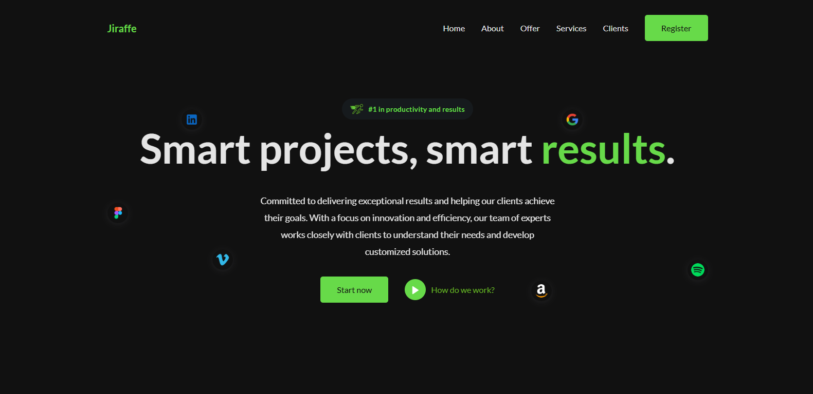
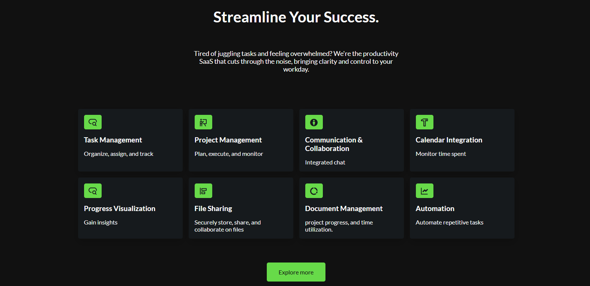

# **🌐 Saas Landing Page**

This project is a modern and responsive **SaaS landing page** built using **HTML, CSS, and JavaScript**, with a clean UI focused on delivering a smooth and engaging user 
experience.

## **🛠️ Main Features**

- **Modern and responsive design**, built with UI/UX best practices to ensure usability across all devices.
- **Flexible layout** using **CSS Grid** and **Flexbox** to structure sections in a clear, adaptable way.
- **BEM methodology** (Block Element Modifier) is used for CSS class naming, which improves code readability and maintainability. With BEM, class names are more predictable and
  reusable across the project.
- **Smooth scroll animations** powered by the **ScrollReveal** library, enhancing user interaction as content appears dynamically on scroll.
- **Responsive carousel** created using **Swiper CSS**, fully optimized for touch devices and smaller screens.

## **🧱 Technologies Used**

- **HTML5** for semantic structure.
- **CSS3** with **BEM methodology**, Grid, and Flexbox.
- **JavaScript** for dynamic interactions.
- **ScrollReveal** for scroll-triggered animations.
- **Swiper CSS** for mobile-friendly, responsive carousels.

---

This project demonstrates how to build a professional-quality landing page with clean code, organized structure, and interactive features, all without any front-end frameworks.

# **📷 Screenshot**

